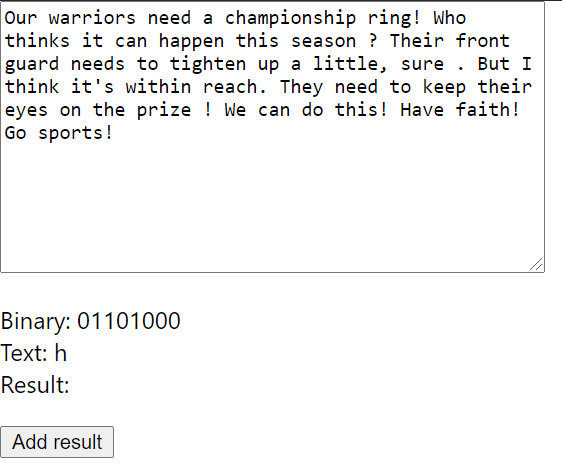
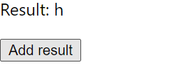
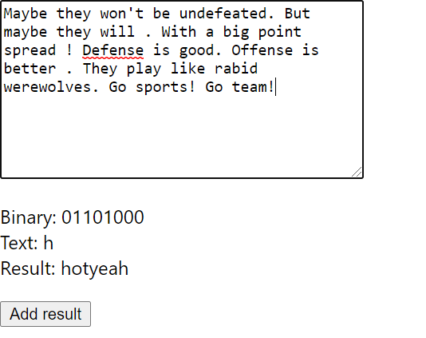

# Modern Rogue - Hidden text in tweets

Featured twitter account: https://twitter.com/DressRobot

Modern Rogue youtube: https://www.youtube.com/channel/UC42VsoDtra5hMiXZSsD6eGg

i didnt need to use react but i needed practice :)

# How to use

Enter text into the textarea, the resulting binary code will be automatically converted to text.

 
 

 
Click the 'Add result' button to add the decoded letter to the final result.

 
 

The message featured in the Modern Rogue's video on this topic is pictured above.